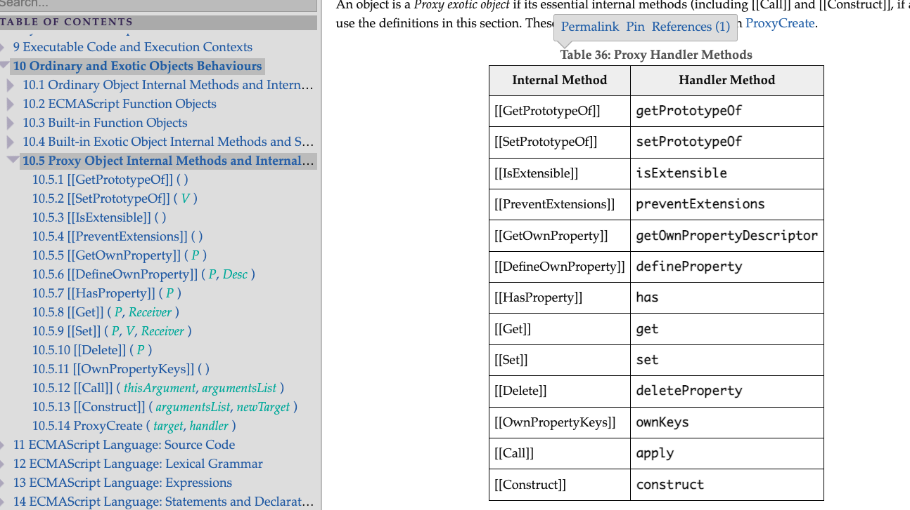

# Proxy 

- Proxy
  - 중간에서 가로채어 오퍼레이션을 대리, 대신하여 실행
  - 전체 괘도를 벗어날 수 없으며 오퍼레이션을 완전히 바꿀 수는 없음 
  - 예)
    `get` 을 하는 경우 `get` 대신에 `set` 을 할 수 없음.
    `get` 이라는 괘도 안에서 다른 일을 대신 실행할 수 있음. 
  
  <br />
  

  ```js
  const counter = {order: '☕️'};  
  const a = '';
  const customer = counter.order;
  console.log(customer); // ☕️
  ```

  <br />
  `counter.order` 가 함수를 호출하지 않고 프로퍼티로 값을 구했으면 이것이 `getter`이고, `getter`를 실행하면 값이 반환된다 -> 이게 기본 오퍼레이션이다

  - '☕️' 를 구하는 행위 즉, 값을 구하는 메소드가 필요한데 이 때, 엔진은 `getter` 기능을 가진 내부 메소드 `[[Get]]` 을 호출한다 
  - 호출 순서
    - `[[Get]]` 은 `counter` 오프젝트의 `__proto__`에 있는 `[[Get]]`을 호출한다
    - `[[Get]]` 을 호출하면서 파라미터 값으로 `order`를 넘겨준다
    - `[[Get]]` 메소드가 `order`를 프로퍼티 키로 하여 프로퍼티 값을 구해 반환한다
  

  <br />

  - ES6 가 가진 13개의 기본 오퍼레이션
    
    [10.5 Proxy Object Internal Methods and Internal Slots](https://tc39.es/ecma262/#sec-proxy-object-internal-methods-and-internal-slots)


  ## 왜 Proxy 가 필요할까? 

  

- Proxy Trap
- Reflect